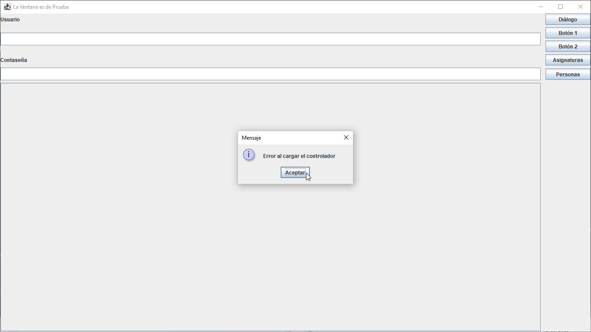

# DB and Java Swing

## Project definition | Enunciado

Attention❗: I made the English translation from the definition given by the teacher, in Spanish, so any grammatical, orthographic or meaning error is my fault.

¡Atención❗: El enunciado en inglés ha sido mi traducción del enunciado entregado por el profesor (en español), por lo que cualquier error gramatical, ortográfico o de significado, en inglés, es _mea culpa_.

| | ENG | ES |
|---- |---- |---- |
| 🗣 | DB and Java Swing proyect |Proyecto BBDD y Java Swing
| ☝ |Mandatory requirements: |Requisitos obligatorios:
| 1️⃣ | CRUD from "Persona" table in the db. |- Modificar, Borrar e insertar la tabla Personas.
| 2️⃣ | CRUD from "Asignatura" table. |- Modificar, Borrar e insertar la tabla Asignaturas.
| ☝ | Optional requirements: |Requisitos Opcionales (Máxima Nota)
| 1️⃣ | Implement the search from both tables applying filters |- Búsqueda (Aplicar filtros) en ambas tablas

> ❗🇪🇸 **NOTA:** Recuerden que en la aplicación que se les ha pasado, 
existen 2 ficheros de Modelo de datos, por lo tanto deben haber 2 ficheros de Controladores

> ❗🇬🇧 **NOTE:** Please, take into account there are 2 data model files in the template, thus there must be 
 also 2 controllers files.
 
## Desarrollo del proyecto
### State of the work

View without the database linked:

View after the database was settled up:

### Tareas

- ⬜ _Persona_ CRUD
  - ⬜ Get data from _Persona_ table
  - ⬜ Create new _Persona_
  - ⬜ Show _Persona_ data in UI
  - ⬜ Update _Persona_ data
  - ⬜ Delete _Persona_ data
- ⬜ _Asignatura_ CRUD
  - ⬜ Get data from _Asignatura_ table
  - ⬜ Create new _Asignatura_
  - ⬜ Show _Asignatura_ data in UI
  - ⬜ Update _Asignatura_ data
  - ⬜ Delete _Asignatura_ data

### Possible improvements detected

⬜ 🐞 When closing the app, if there isn't a database linked, the app can't be closed.

⬜ 🎨 Unaesthetic ui: There is no margin nor padding between elements and the window borders.

⬜ 🎨 Improve the aesthetic UI: (example below)

