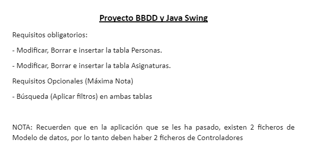
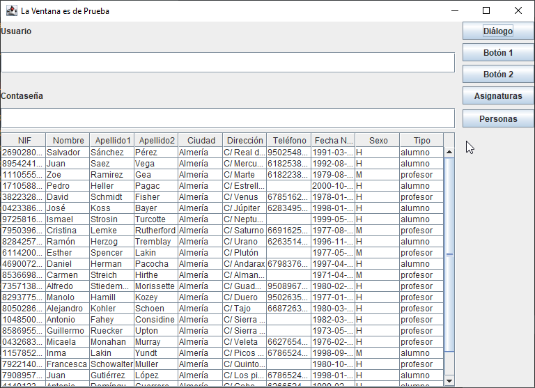
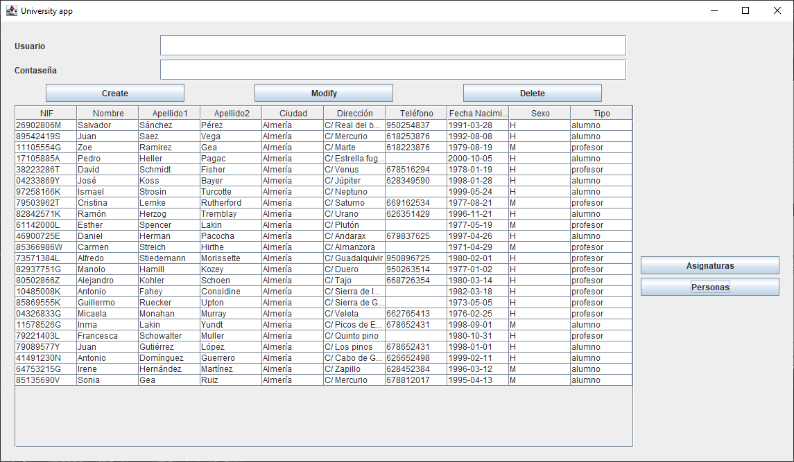
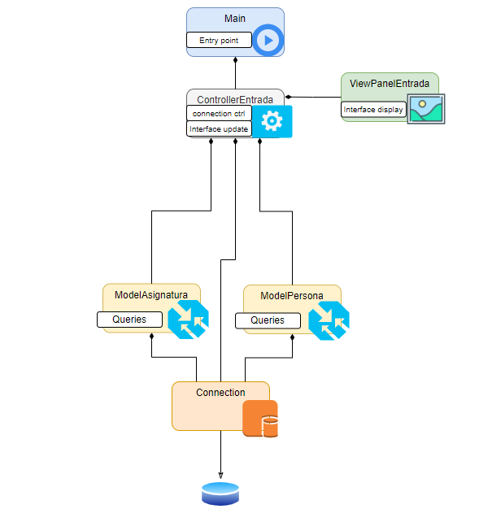
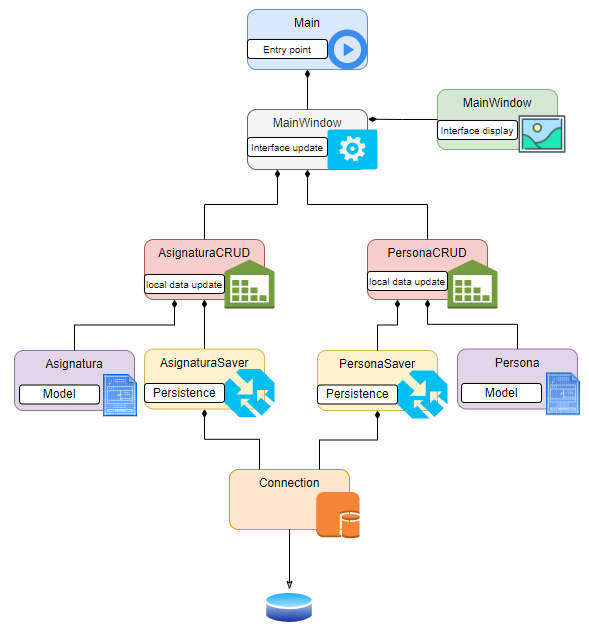
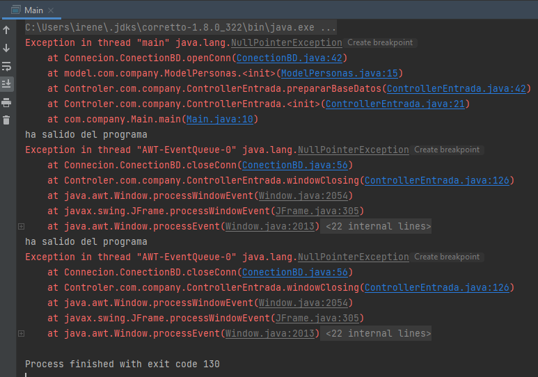
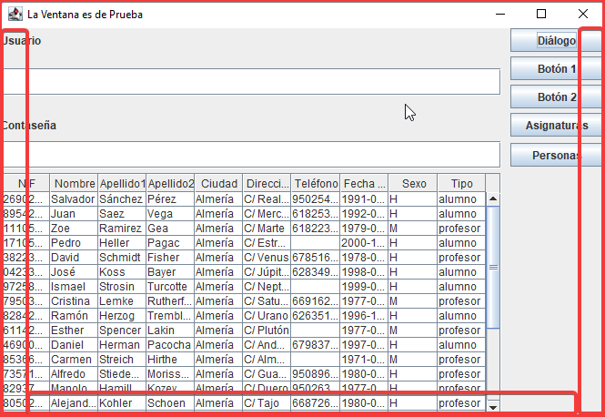
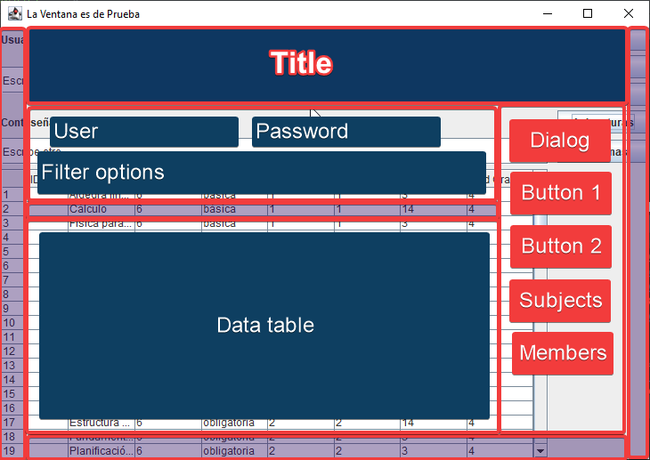

# 🔆DB and Java Swing🔆

## 📓Project definition📓

🗣 **DB and Java Swing proyect**

☝ Mandatory requirements:
- 1️⃣ CRUD from "Persona" table in the db.
- 2️⃣ CRUD from "Asignatura" table.

☝ Optional requirements:
- 1️⃣ Implement the search from both tables applying filters

> ❗ **NOTE:** Please, take into account there are 2 data model files in the template, thus there must be 
 also 2 controllers files.
 
## 👩‍💻Project development👩‍💻

### 🔎State of the work

|Initial appearance | Current appearance |
|----|----|
| |  |

|Initial architecture | Desired architecture |
|----|----|
||  |

### 📋TODOs

- ⬜ _Persona_ CRUD
  - ✅ Get data from _Persona_ table
  - ⬜ Create new _Persona_
  - ⬜ Show _Persona_ data in UI
  - ⬜ Update _Persona_ data
  - ⬜ Delete _Persona_ data
- ⬜ _Asignatura_ CRUD
  - ✅ Get data from _Asignatura_ table
  - ⬜ Create new _Asignatura_
  - ⬜ Show _Asignatura_ data in UI
  - ⬜ Update _Asignatura_ data
  - ⬜ Delete _Asignatura_ data

### ❓Possible improvements detected

⬜ 🐞 When closing the app, if there isn't a database linked, the app can't be closed.

⬜ 🎨 Unaesthetic ui: There is no margin nor padding between elements and the window borders.

⬜ 🎨 Improve the aesthetic UI: (example below)

